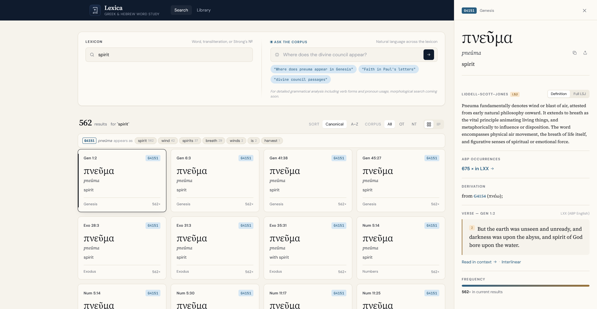
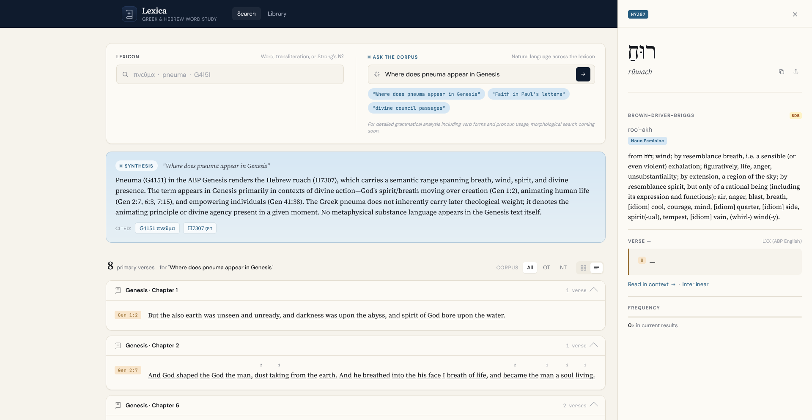
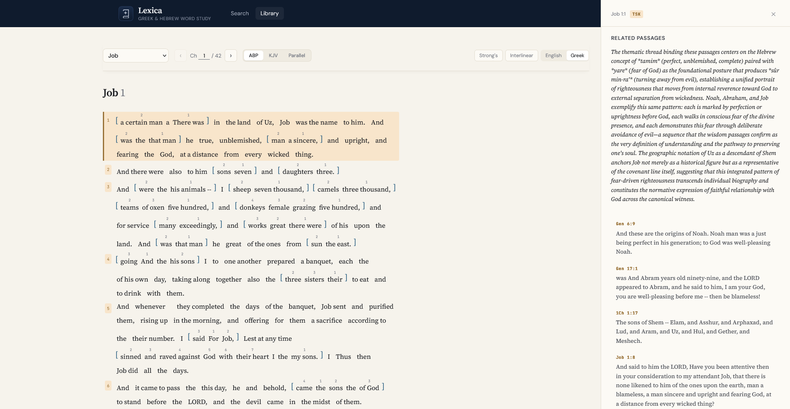

# Lexica — Greek & Hebrew Word Study

Lexica is a free, open Bible study tool built for anyone who wants to go deeper than the English text — without needing years of seminary training.

Think of it as an AI-supercharged eSword: every Greek and Hebrew word is one click away from its full lexicon entry, and a natural language search engine lets you ask the text questions directly.

## The Berean Approach

Lexica is built on a simple principle: **the text speaks first**. No imported systematic theology, no denominational assumptions. When you search a word or ask a question, the app anchors every answer in the Greek and Hebrew source words — then lets you draw your own conclusions.

## What You Can Do

**Read** — The Apostolic Bible Polyglot (ABP) interlinear alongside the King James Version, with parallel view. Every word is clickable.

**Study words** — Click any word to open its full Liddell-Scott-Jones (Greek) or Brown-Driver-Briggs (Hebrew) lexicon entry, with an AI-generated summary of the sense most relevant to that passage.

**Search the corpus** — Search by English, Greek, transliteration, or Strong's number. Results show every occurrence across all 66 books with gloss variants and occurrence counts, filterable by OT or NT.

**Ask questions** — The AI search understands natural language: "where does Paul use pistis in Romans", "divine council passages in the OT", "where does pneuma appear in Genesis". It reasons across Greek and Hebrew simultaneously.

**Explore connections** — Click any verse number to open its Torrey's Treasury of Scripture Knowledge cross-references, curated and synthesized by AI to surface the strongest thematic connections.

---

*Lexicon search with LSJ definition and occurrence groupings*

*AI natural language search reasoning across Greek and Hebrew*

*Cross-reference panel with AI thematic synthesis*

*ABP and KJV parallel interlinear with Strong's numbers*

---

## What's Under the Hood

- **ABP interlinear** — full 66-book Greek/English word-level text with Strong's tagging
- **KJV** — full 31,102 verse text with word-level Strong's mapping
- **LSJ** — Liddell-Scott-Jones Greek lexicon
- **BDB** — Brown-Driver-Briggs Hebrew lexicon (8,674 entries)
- **TSK** — Torrey's Treasury of Scripture Knowledge (386,518 cross-reference pairs)
- **AI** — Claude Haiku for natural language search, lexicon summaries, and cross-reference synthesis

## Support This Project

Lexica is free and will stay free. AI queries have a small cost — if this tool has been useful to your studies, consider supporting it.

⭐ Star this repo | ☕ Ko-fi coming soon

## Built With

Flask · SQLite · React 18 · Claude Haiku · PythonAnywhere
